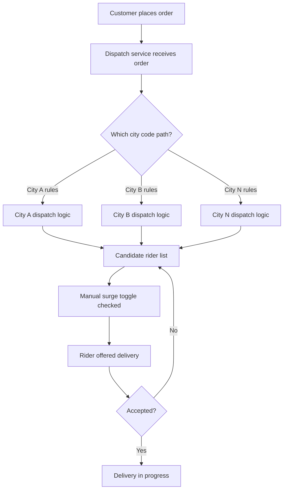
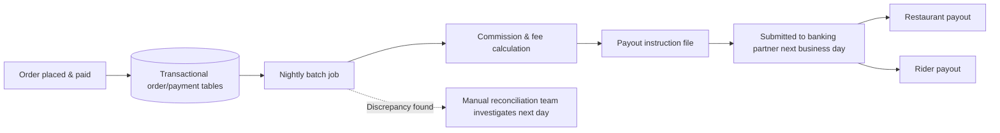

# As-Is Business Architecture

## Overview

This document describes ForkRoute's current (as-is) business architecture for the three process areas central to the expansion program: order dispatch and driver allocation, restaurant partner onboarding and integration, and payments/reconciliation. It is the baseline against which the [to-be business architecture](to-be-business-architecture.md) and the [capability map](capability-map.md) maturity ratings are assessed.

## Order Dispatch and Driver Allocation (As-Is)

When a customer places an order, the dispatch process determines which available rider is offered the delivery, using a mix of proximity, rider rating, and current load. This logic exists as **city-specific code paths** within the dispatch service: the home market's platform grew city by city, and each city's operations team, wanting control over local behavior (delivery radius, batching of multiple orders per rider, surge activation), got that control by having engineering hand-code it. There is no single authoritative rule set — there are, in practice, as many rule variants as there are cities with meaningfully different logic, and no registry of which cities run which variant.

Surge pricing, where it exists at all today, is a manual operational toggle a city operations manager flips during a demand spike; it applies a flat multiplier city-wide rather than a calculated, granular adjustment, and it is not tied to any live view of driver supply.

## Restaurant Partner Onboarding and Integration (As-Is)

All 15,000 restaurant partners integrate through a single shared integration tier — one set of services handling menu sync, order injection, and status updates for every partner regardless of size or traffic pattern. There is no per-partner resource isolation: a large restaurant chain's menu-sync job or a traffic spike from one partner's promotional campaign runs in the same shared infrastructure as a single independent restaurant's order flow, with no circuit breaker or throttle preventing one partner's load from degrading another's experience — or the platform's overall order intake.

Onboarding a new partner is a semi-manual process: a partnerships team member configures the partner in an admin console, and a solutions engineer typically assists with menu-format mapping for anything outside the standard template. This works adequately at current partner volume but does not scale cleanly to the roughly 2.5x partner count implied by four new markets.

## Payments and Reconciliation (As-Is)

Money movement — customer charge, restaurant payout, rider payout, platform commission — is tracked across several transactional tables that are the operational system of record during the day, but the **authoritative reconciliation** that confirms all parties' books agree happens as a nightly batch job. The batch job aggregates the day's transactions, applies commission and fee logic, and produces payout instructions that are then submitted to banking partners the following business day.

This means: a restaurant or rider who completed work today does not see funds move until at least the next business day, discrepancies are only surfaced once daily rather than as they occur, and there is no mechanism to calculate or apply a dynamic price adjustment (surge) that flows correctly through to payout splits in real time — the batch model assumes each day's pricing was static and known in advance.

## Why This Matters for Expansion

Each of these three as-is patterns fails a specific expansion requirement: city-coded dispatch logic does not generalize to new markets without repeating the coding effort; the shared-fate integration tier does not tolerate a larger, more volatile partner base without new isolation controls; and batch reconciliation does not meet the real-time payout and dynamic pricing expectations that ForkRoute's expansion markets are being positioned to require competitively. The [to-be business architecture](to-be-business-architecture.md) addresses all three directly.

---
*Fictional case study — see [README](../README.md) for full disclaimer.*
