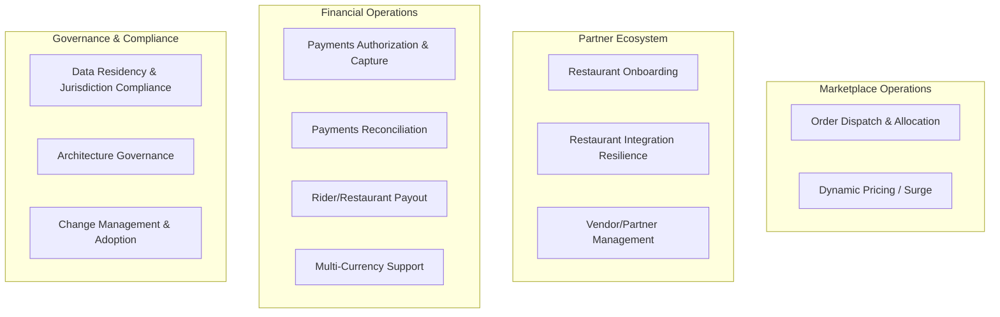

# Capability Map

## Purpose

This capability map inventories ForkRoute's core business capabilities relevant to the expansion program, rates each on a 1–5 maturity scale as-is, and states the target maturity required to support the four-market expansion. Maturity is rated against a standard capability-maturity rubric: **1 = ad hoc/manual, 2 = repeatable but inconsistent, 3 = defined and documented, 4 = managed and measured, 5 = optimized and self-improving.**

## Capability Maturity — As-Is vs. Target

| Capability | As-Is Maturity | Target Maturity | Gap Driver |
|---|---|---|---|
| Order Dispatch & Allocation | 2 — repeatable per city, but inconsistent and undocumented across cities | 4 — managed, config-driven, measured against SLA | City-coded logic with no central rule registry |
| Dynamic Pricing / Surge Management | 1 — manual toggle, no calculation | 4 — automated, live-data-driven, auditable | No real-time supply/demand signal integration |
| Restaurant Partner Onboarding | 3 — defined process, semi-manual | 4 — mostly self-service, managed exceptions | Manual solutions-engineering bottleneck for standard cases |
| Restaurant Integration Resilience | 1 — shared-fate, no isolation | 4 — multi-tenant isolated, measured blast radius | No per-tenant containment in integration tier |
| Payments Authorization & Capture | 3 — defined, real-time at transaction level | 4 — managed, event-sourced, fully auditable | Authorization/capture is real-time already; reconciliation downstream is not |
| Payments Reconciliation | 1 — nightly batch, manual discrepancy handling | 4 — continuous, automated, near-real-time alerting | Batch-only model with no live event trail |
| Rider/Restaurant Payout | 2 — repeatable but next-business-day only | 4 — managed, sub-30-minute target, measured | Payout timing tied to batch reconciliation cadence |
| Data Residency & Jurisdiction Compliance | 1 — retrofitted per market historically | 4 — designed-in, measured compliance at launch | No jurisdiction-aware data architecture today |
| Multi-Currency / Multi-Locale Support | 2 — single-currency assumptions embedded in payments core | 4 — managed, currency as first-class parameter | Currency treated as constant, not parameter, in financial code |
| Architecture Governance | 1 — no standing ARB prior to this program | 4 — managed, ARB with defined cadence and enforcement | No formal governance body existed before this engagement |
| Vendor/Partner Ecosystem Management | 2 — ad hoc vendor relationships | 3 — defined evaluation and management process | No formal vendor scoring or governance process |
| Change Management & Adoption | 1 — no formal change practice for platform-level shifts | 3 — defined, measured adoption metrics | Historically technology-led rollout with minimal structured change support |

## Capability Map (Grouped View)

## Reading the Gaps

The three largest gaps — Dynamic Pricing/Surge Management (1→4), Restaurant Integration Resilience (1→4), and Payments Reconciliation (1→4) — map directly to the three structural problems named in the [vision and scope](../01-phase-a-vision-and-scope/vision-and-scope.md). This is intentional: the capability map is used here as a diagnostic confirming that the program's technical scope actually targets the capabilities with the largest maturity gaps, rather than the capabilities that happen to be easiest to improve. Data Residency (1→4) is the fourth major gap and is the one most directly tied to expansion-market legal requirements rather than home-market operational pain, which is why it did not surface as an urgent problem until the expansion mandate made it one — see the [gap analysis](../05-phase-e-opportunities-and-solutions/gap-analysis.md) for prioritization against the others.

Architecture Governance and Change Management are rated lower-priority target maturities (3, not 4) deliberately: the program's primary mandate is the technical platform, and over-investing in process maturity beyond what the program itself needs would divert budget from the capabilities the business case is funded to fix.

---
*Fictional case study — see [README](../README.md) for full disclaimer.*
