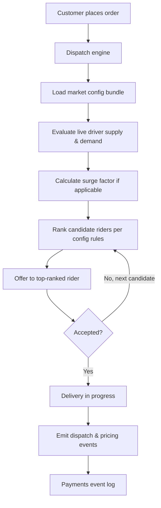
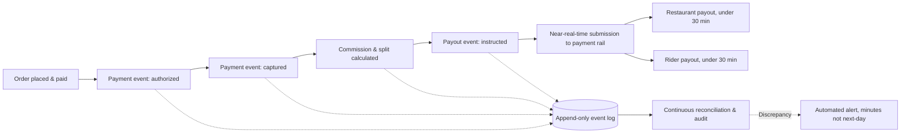

# To-Be Business Architecture

## Overview

This document describes the target (to-be) business architecture for order dispatch, restaurant integration, and payments/reconciliation, and explains how each addresses the specific as-is limitation identified in the [as-is business architecture](as-is-business-architecture.md).

## Order Dispatch and Driver Allocation (To-Be)

A single dispatch engine evaluates every order against a **market-specific configuration bundle** — dispatch radius, batching rules, rider-matching weights, and surge parameters — loaded at runtime rather than compiled into code. A new market or a rule change in an existing market is authored, validated against a schema and a simulation harness, and published; no service redeployment is required. Surge pricing becomes a calculated function of live driver-supply and demand signals within each market's configured bounds, not a manual city-wide toggle, and it feeds directly into the event-driven payments backbone so that a rider's or restaurant's payout for a surge order reflects the correct split in real time.

This is the core decision addressed in [ADR-001](../adrs/adr-001-config-driven-dispatch-engine.md); the reference architecture for the underlying event-driven backbone is in [Phase D](../04-phase-d-technology-architecture/reference-architecture.md).

## Restaurant Partner Onboarding and Integration (To-Be)

The integration platform becomes explicitly **multi-tenant**: each restaurant partner (or partner group, for chains) is provisioned with isolated rate limits, dedicated processing lanes, and independent circuit breakers, so that one partner's traffic anomaly or integration defect degrades only that partner's flow. Onboarding is streamlined through self-service menu-format templates for the majority case, with solutions-engineer assistance reserved for genuinely nonstandard integrations — a deliberate reallocation of scarce solutions-engineering time toward the partners who actually need it.

## Payments and Reconciliation (To-Be)

Every financial event — charge authorization, capture, commission calculation, payout instruction, dispute — is written to an **append-only, replayable event log** that is the authoritative system of record. Reconciliation becomes a continuous, event-driven audit process rather than a nightly batch: discrepancies are detected within minutes of occurring, not up to 24 hours later, and payout instructions can be generated and submitted in near-real time, supporting the sub-30-minute payout target in [vision-and-scope.md](../01-phase-a-vision-and-scope/vision-and-scope.md). This is the core decision in [ADR-002](../adrs/adr-002-event-driven-payments-reconciliation.md).

## Cross-Cutting Business Process Change

Two operational changes ride alongside the technical re-architecture and are addressed in the [change management plan](../08-phase-h-change-management/change-management-plan.md):

- **City operations managers lose direct manual control over surge pricing** in favor of the automated engine, which is a genuine authority change for that role, not just a tooling change. This is deliberately called out as an adoption risk, not glossed over.
- **The partnerships and solutions-engineering teams shift from uniform hands-on onboarding to a triage model**, spending relatively more time on complex partners and relatively less on the standard case, which changes how their workload and staffing model should be planned.

## What Does Not Change

The customer-facing ordering flow, the restaurant-facing order-acceptance flow, and the rider app's delivery-acceptance flow are **not** being redesigned in this program — the to-be architecture changes what happens behind those interfaces (how dispatch decides, how money moves, how partners are isolated), not the interfaces customers, restaurants, and riders directly interact with. This scoping decision is deliberate and is recorded in [vision-and-scope.md](../01-phase-a-vision-and-scope/vision-and-scope.md) under out-of-scope items.

---
*Fictional case study — see [README](../README.md) for full disclaimer.*
