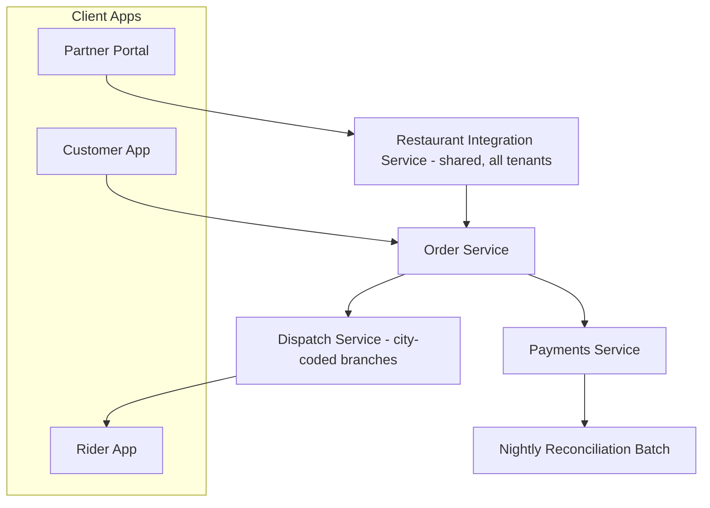
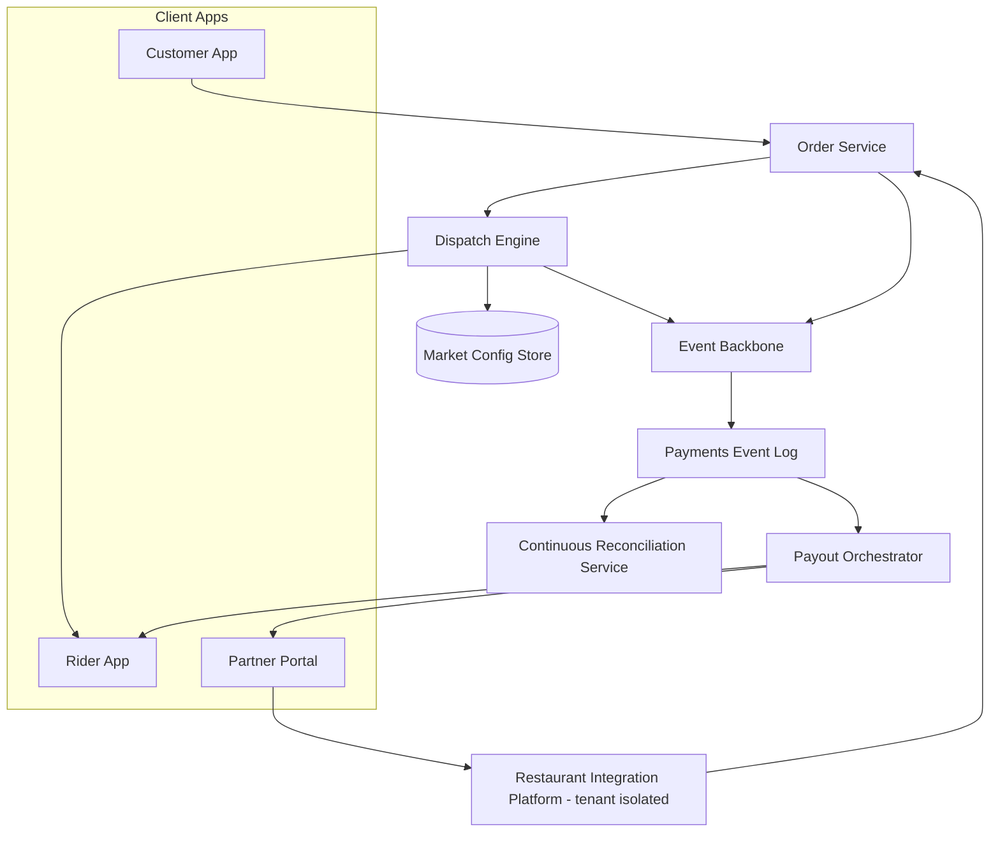

# Application Architecture (Phase C2)

## Overview

This document covers the application architecture sub-phase of Phase C: the as-is application landscape, the to-be service decomposition, and the integration patterns connecting them. It should be read alongside [data-architecture.md](data-architecture.md), which covers the same transition from the data perspective.

## As-Is Application Landscape

The current platform is best described as a **modular monolith with city-coded branches**: a single deployable dispatch service contains conditional logic keyed on city ID, a single restaurant-integration service handles all partner traffic without tenant separation, and a payments service writes to transactional tables that a separate nightly batch job reads to produce reconciliation output. These are not, strictly, three separate monoliths merged into one deployable — they are three separately deployed services, each of which is internally monolithic with respect to the dimension that now needs to vary (city, tenant, and settlement timing respectively).

## To-Be Application Landscape

The target architecture decomposes the three problem areas into services organized around the axis that must vary independently — market configuration for dispatch, tenant for integration, and event stream for payments — while deliberately **not** decomposing further than that. This is a considered constraint: the program is not pursuing a maximalist microservices decomposition. Order management, for instance, remains a single service; it was evaluated for splitting and rejected, because no requirement in this program's scope depends on order management varying per market or per tenant the way dispatch, integration, and payments do.

## Key Architectural Decisions Reflected Here

- **Dispatch as an engine plus data, not an engine plus code branches** (Principle 1, [ADR-001](../adrs/adr-001-config-driven-dispatch-engine.md)): the Dispatch Engine service is a single deployable across all markets; per-market behavior lives entirely in the Market Config Store.
- **Restaurant Integration Platform as explicitly multi-tenant** (Principle 2, [ADR-003](../adrs/adr-003-multi-tenant-restaurant-integration-platform.md)): tenant isolation is an architectural property of this one service, not something bolted onto the shared platform via ad hoc rate limits.
- **Payments Event Log as the system of record, with Continuous Reconciliation and Payout Orchestrator as downstream consumers** (Principle 3, [ADR-002](../adrs/adr-002-event-driven-payments-reconciliation.md)): this is the most significant topology change from as-is, replacing "batch job reads transactional tables" with "services subscribe to an event stream."

## Integration Patterns

| Pattern | Used For | Rejected Alternative | Why Rejected |
|---|---|---|---|
| Event-carried state transfer (async pub/sub) | Payments state propagation to reconciliation, payout, analytics | Synchronous request/response from each consumer to the payments service | Would create tight coupling and a shared-fate dependency the moment any one consumer is slow — the opposite of the isolation this program is trying to achieve |
| Config-as-data with runtime evaluation | Dispatch rule variation per market | Feature-flag-per-city inside a single code path | Feature flags don't scale cleanly past a handful of binary toggles; the dispatch rule set has too many interacting parameters (radius, batching, weighting) to express safely as flags |
| Tenant-scoped API gateway with per-tenant quotas | Restaurant partner traffic isolation | A single gateway with global rate limiting only | Global limiting protects the platform in aggregate but does nothing to stop one noisy tenant from starving another's quota within the global ceiling |
| Synchronous request/response | Order placement (customer to Order Service), dispatch offer (Dispatch Engine to Rider App) | Fully event-driven order placement | Order placement has a hard user-facing latency expectation (sub-2-second confirmation); the added latency and complexity of full event-driven orchestration for this specific interaction was judged not worth it — a case where the program deliberately did *not* apply Principle 3's event-sourcing bias outside the payments domain it was written for |

## What Stays a Monolith, Deliberately

Order Service and Rider Service are unchanged in this program. Both were evaluated against the same "does this need to vary by market or tenant independently of the rest of the platform" test applied to dispatch, integration, and payments, and both failed that test — their behavior is materially the same across all markets. Decomposing them anyway, on the theory that "more services is more architecturally mature," was explicitly rejected by the ARB as scope creep that would consume engineering capacity without addressing a gap identified in the [capability map](../02-phase-b-business-architecture/capability-map.md).

---
*Fictional case study — see [README](../README.md) for full disclaimer.*
