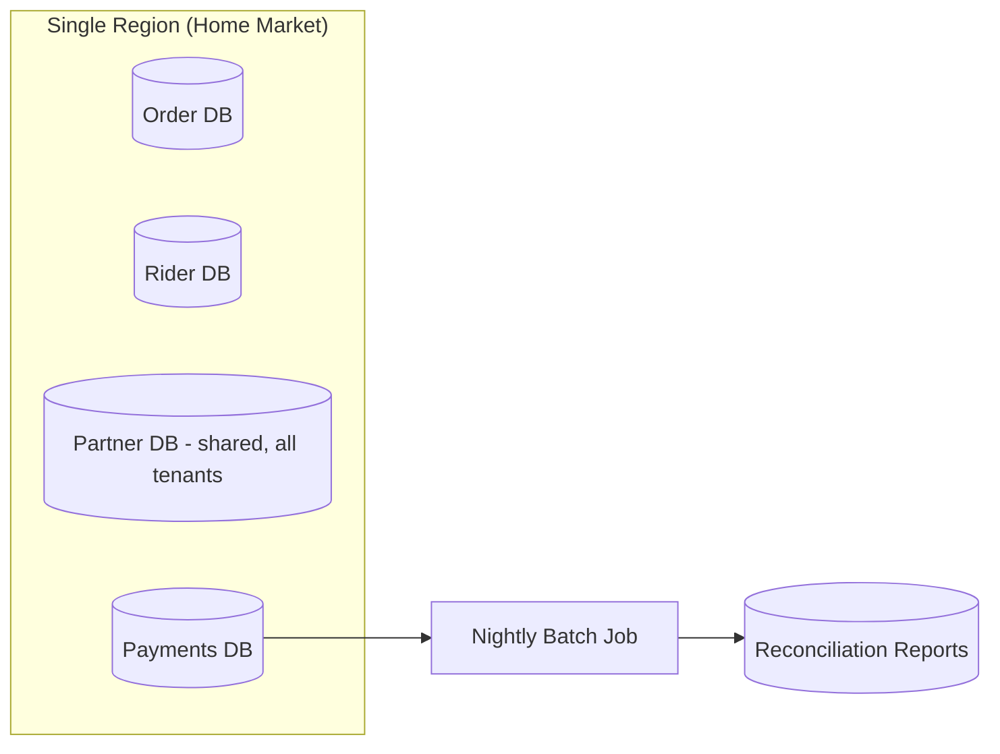
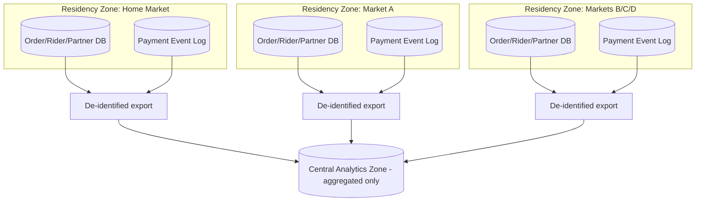

# Data Architecture (Phase C1)

## Overview

This document covers the data architecture sub-phase of Phase C: the core data domains and entities involved in dispatch, payments, and partner integration, the as-is vs. to-be data topology, and the data residency approach that Principle 4 (see [architecture-principles.md](../00-preliminary/architecture-principles.md)) requires for the four expansion markets.

## Core Data Domains

| Domain | Key Entities | System of Record (As-Is) | System of Record (To-Be) |
|---|---|---|---|
| Order | Order, OrderLine, DeliveryAddress | Order service transactional DB | Order service transactional DB (unchanged) |
| Dispatch | DispatchOffer, RiderCandidate, MarketConfigBundle | Embedded in city-coded dispatch logic (no distinct entity) | Dispatch engine + versioned config store |
| Rider | Rider, RiderShift, RiderLocation | Rider service DB | Rider service DB (unchanged), location feed also published as events |
| Restaurant Partner | Restaurant, MenuItem, PartnerContract | Partner platform shared DB | Partner platform DB, tenant-partitioned |
| Payment | PaymentAuthorization, Capture, Commission, PayoutInstruction | Transactional payments DB + nightly batch output | Append-only payment event log (system of record) + materialized views |
| Pricing | BaseFare, SurgeFactor, PriceQuote | Not modeled as distinct entity (surge is a manual multiplier) | First-class SurgeFactor entity computed and logged per order |
| Identity/Compliance | CustomerProfile, KYCRecord, DataResidencyTag | Single global customer table | Customer table partitioned/tagged by jurisdiction |

## As-Is Data Topology

Today, data lives in market-agnostic, mostly single-region transactional databases, with payments reconciliation adding a batch-derived reporting layer on top. There is no concept of a jurisdiction tag on customer or transaction records — everything is stored as though a single legal jurisdiction applies, because until now, it has.

## To-Be Data Topology

The target topology introduces **jurisdiction as a first-class partitioning dimension**. Each of the four expansion markets is assigned to a data residency zone; customer, rider, and restaurant PII, along with transactional payment data, is stored and processed within that zone. Cross-market aggregate reporting is built from de-identified or aggregated exports pushed to a central analytics zone — it does not query production data across zones live.

## Data Residency Decision

Three of the four target markets carry data localization requirements that a single-region, global data plane cannot meet without a retrofit. The architecture decision — assign each market (or market group, where markets share compatible legal frameworks) to a residency zone at design time rather than after launch — is recorded in [ADR-005](../adrs/adr-005-market-expansion-data-residency-strategy.md). The key trade-off: cross-market analytics that today can run as a single live query become dependent on a daily export-and-aggregate pipeline, adding latency to global reporting (same-day, not real-time) in exchange for regulatory compliance at launch instead of after a costly retrofit.

## Master Data and the Config Bundle

The `MarketConfigBundle` entity — the versioned dispatch, surge, and payout rule set per market described in the [to-be business architecture](../02-phase-b-business-architecture/to-be-business-architecture.md) — is itself treated as governed master data: every version is immutable once published, changes go through the same schema validation and ARB-adjacent review as any other production change, and the dispatch engine always logs which config version handled a given order, giving full auditability over which rule set produced which dispatch decision. This traceability is a direct requirement from the Head of Security & Compliance stakeholder group (see [stakeholder-map.md](../01-phase-a-vision-and-scope/stakeholder-map.md)), who needed a defensible answer to "why did this rider get this order" for dispute handling.

## Integration Patterns

- **Event-carried state transfer** for payments (Principle 3): downstream consumers (reconciliation, analytics, support tooling) subscribe to the payment event log rather than querying the payments service's internal state directly.
- **Change-data-capture-free by design** for the config bundle: because config is published, not mutated in place, there is no need for CDC to detect drift — the version itself is the audit record.
- **Batch export, not live federation**, for cross-zone analytics, as described above — a deliberate rejection of a live cross-region query federation layer, which was considered and rejected primarily on residency-compliance grounds (a live federated query engine makes it too easy to accidentally cross a jurisdiction boundary) and secondarily on latency and operational-complexity grounds.

---
*Fictional case study — see [README](../README.md) for full disclaimer.*
