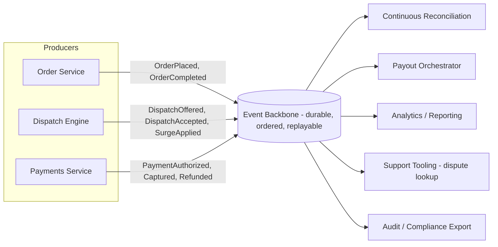

# Reference Architecture: Event-Driven Dispatch & Payments Backbone

## Purpose

This document defines the reference architecture for the event-driven backbone that underpins both the config-driven dispatch engine ([ADR-001](../adrs/adr-001-config-driven-dispatch-engine.md)) and the event-sourced payments/reconciliation model ([ADR-002](../adrs/adr-002-event-driven-payments-reconciliation.md)). It is written as a reusable reference pattern, applicable beyond this one program, with explicit conditions under which it applies and — critically — conditions under which it does not.

## The Pattern

An **event backbone** (a durable, ordered, replayable log) sits between order/dispatch/pricing producers and the consumers that need to react to state changes: reconciliation, payout orchestration, analytics, support tooling, and audit. Producers append events; they do not call consumers directly. Consumers subscribe to the streams relevant to them and maintain their own materialized view of state, rebuildable by replaying the log.

## Applicability Conditions

This pattern is appropriate when **all** of the following hold:

1. **Multiple independent consumers need the same underlying state changes**, and coupling them via direct synchronous calls from the producer would create a shared-fate dependency (this is exactly ForkRoute's payments case: reconciliation, payout, analytics, and support all need to know about the same payment events, independently of each other).
2. **An audit trail of "what happened, in what order" has intrinsic value** beyond just the current state — financial and dispatch-decision auditability being the clearest examples here.
3. **Consumers can tolerate eventual consistency** on the order of low seconds between an event occurring and a consumer's materialized view reflecting it.
4. **The team owns the operational maturity to run a durable log** (schema governance, consumer lag monitoring, replay tooling, dead-letter handling) — this is real, ongoing operational overhead, not a one-time setup cost.

## When NOT to Use This Pattern

This is stated explicitly because event-driven architecture is frequently over-applied past the point where it earns its complexity. The ARB rejected using this pattern in three places during this program's design, and those rejections are recorded here as the anti-pattern guidance for future work:

- **Customer-facing order placement confirmation.** The customer app needs a synchronous, sub-2-second confirmation that an order was accepted. Routing this through an async event backbone and having the client poll or subscribe for a confirmation event would add latency and failure modes (what does the UI show if the confirmation event is delayed?) with no corresponding benefit — there is exactly one consumer of this response (the customer app), and it needs the answer now. **Use synchronous request/response instead.**
- **Any interaction where the caller cannot proceed without an immediate, strongly-consistent answer.** Rider app "is this delivery still assigned to me" checks during an active delivery are a strongly-consistent read against current state, not a candidate for eventual-consistency-tolerant event replay. **Use a direct query against the owning service's current state instead.**
- **Low-volume, low-fan-out interactions where a durable log is pure overhead.** The restaurant partner onboarding workflow (a partnerships team member configuring a new partner) has one producer and effectively one consumer (the partner platform itself) and happens at a rate of tens of times per day, not thousands of times per second. Standing up event infrastructure for this would be solving a scaling problem that does not exist here. **Use a straightforward transactional write with an application-level notification (e.g., an internal webhook or email) instead.**
- **Where strict, immediate cross-entity consistency is a hard legal or financial requirement that eventual consistency cannot satisfy at all**, e.g., a same-transaction guarantee that a payout can never be instructed against a payment that has not yet cleared authorization. In this program, that specific invariant is enforced with a synchronous check inside the Payments Service before the `PaymentAuthorized` event is even emitted — the event backbone is downstream of the invariant, never the sole enforcement mechanism for it.

## Failure Mode and Resilience Considerations

- **Consumer lag** is monitored per consumer group; the Payout Orchestrator has an alerting threshold materially tighter (under 2 minutes of lag) than Analytics (up to 4 hours of lag is tolerable), reflecting the differentiated resilience tiering described in Principle 10.
- **Replay is a first-class operational capability**, not an emergency-only procedure — every consumer must be able to rebuild its materialized view from the log from a clean state, and this capability is exercised routinely (at minimum, quarterly) rather than assumed to work.
- **Schema evolution follows Principle 6** (contracts are versioned, backward-compatible); a breaking event schema change requires a new event type version published alongside the old for a defined deprecation window, never an in-place field-meaning change.

## Criticality Tiering Applied to This Backbone

| Consumer | Tier | Availability Target | Max Tolerable Lag |
|---|---|---|---|
| Payout Orchestrator | Tier 1 (financial impact) | 99.95% | 2 minutes |
| Continuous Reconciliation | Tier 1 (financial impact) | 99.95% | 5 minutes |
| Support Tooling (dispute lookup) | Tier 2 | 99.9% | 15 minutes |
| Audit / Compliance Export | Tier 2 | 99.9% | 1 hour |
| Analytics / Reporting | Tier 3 | 99.5% | 4 hours |

This tiering is a direct application of Principle 10 (resilience scoped to business impact, not uniformly maximized) and avoids the cost of engineering every consumer to the strictest tier's standard.

---
*Fictional case study — see [README](../README.md) for full disclaimer.*
