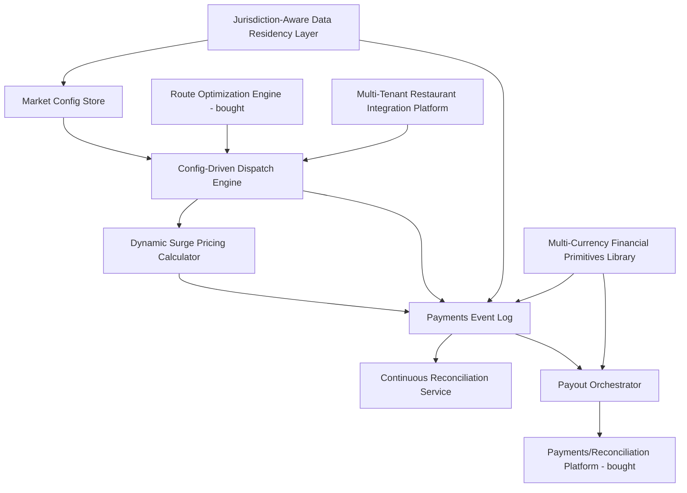

# Solution Building Blocks

## Purpose

This document decomposes the target capabilities identified in the [capability map](../02-phase-b-business-architecture/capability-map.md) into discrete solution building blocks (SBBs) — the buildable or buyable units that, together, deliver the to-be architecture. Each SBB states whether it is built in-house, bought, or a hybrid, applying Principle 7 (build only what differentiates ForkRoute).

## Solution Building Block Inventory

| SBB | Capability Delivered | Build / Buy / Hybrid | Rationale |
|---|---|---|---|
| Config-Driven Dispatch Engine | Order Dispatch & Allocation | Build | Core differentiator; no vendor product encodes ForkRoute-specific marketplace dynamics and rider-matching business logic |
| Market Config Store & Validation Harness | Order Dispatch & Allocation, foundation for all market-specific rules | Build | Tightly coupled to the Dispatch Engine's internal contract; not a generic product |
| Route Optimization / ETA Calculation Engine | Dispatch (routing sub-problem) | Buy | Commodity capability with mature vendor options; building in-house would consume scarce algorithms engineering capacity better spent on dispatch logic itself (Principle 7) — see [vendor-evaluation.md](vendor-evaluation.md) |
| Dynamic Surge Pricing Calculator | Dynamic Pricing / Surge Management | Build | Surge logic is a direct expression of ForkRoute's marketplace economics and competitive positioning; not a candidate for a generic vendor product |
| Multi-Tenant Restaurant Integration Platform | Restaurant Integration Resilience, Onboarding | Build (on top of bought API gateway component) | Tenant isolation logic is ForkRoute-specific; the underlying gateway/rate-limiting infrastructure is bought as a hybrid |
| Payments Event Log & Continuous Reconciliation Service | Payments Reconciliation | Build (on top of bought event-streaming infrastructure) | Reconciliation business logic (commission rules, dispute handling) is ForkRoute-specific; the durable log infrastructure itself is a commodity, bought/managed layer |
| Payout Orchestrator | Rider/Restaurant Payout | Hybrid | Orchestration logic built in-house; actual funds movement delegated to a bought payments/reconciliation platform — see [vendor-evaluation.md](vendor-evaluation.md) |
| Jurisdiction-Aware Data Residency Layer | Data Residency & Jurisdiction Compliance | Hybrid | Zone architecture and enforcement policy designed in-house; underlying regional infrastructure provisioning uses standard cloud-provider residency features, not a bespoke build |
| Multi-Currency Financial Primitives Library | Multi-Currency / Multi-Locale Support | Build | Needs to be embedded consistently across every ForkRoute-owned financial code path; no vendor product substitutes for internal discipline here |
| Architecture Governance Tooling (exception register, decision log, contract templates) | Architecture Governance | Buy (lightweight, off-the-shelf documentation/workflow tooling) | Not a differentiating capability; standard tooling is entirely adequate and building bespoke governance tooling would be a clear Principle 7 violation |

## Decomposition Logic

Building blocks were identified by taking each capability from the capability map with a maturity gap of 2 or more points and asking: what is the smallest set of independently deployable, independently ownable components that closes this gap? Two decomposition alternatives were considered and rejected:

1. **A single "Marketplace Platform" mega-block covering dispatch, pricing, and payments together.** Rejected because it would recreate exactly the kind of tightly coupled, hard-to-reason-about system the program is trying to move away from, and because dispatch, pricing, and payments have different criticality tiers (see [reference-architecture.md](../04-phase-d-technology-architecture/reference-architecture.md)) that argue for independent operational lifecycles.
2. **Decomposing down to the individual microservice level as the unit of SBB tracking** (e.g., separate SBBs for "rider ranking," "radius calculation," "batching logic" within dispatch). Rejected as too granular for architecture-level tracking — that level of decomposition is an implementation decision for the delivery team within the Dispatch Engine SBB, not something the ARB needs to govern block-by-block.

## Dependencies Between Building Blocks

The Jurisdiction-Aware Data Residency Layer and the Multi-Currency Financial Primitives Library are foundational dependencies for nearly every other block — this is why both are sequenced early in the [migration roadmap](../06-phase-f-migration-planning/migration-roadmap.md) rather than built in parallel with the blocks that depend on them.

---
*Fictional case study — see [README](../README.md) for full disclaimer.*
