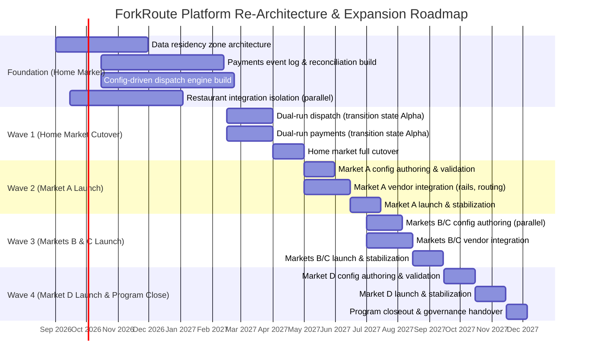

# Migration Roadmap

## Sequencing Principle

The roadmap is sequenced by the dependency logic established in the [gap analysis](../05-phase-e-opportunities-and-solutions/gap-analysis.md): foundational, high-dependency gaps (data residency, then payments backbone, then dispatch engine) are built first against the home market, with parallel work on restaurant integration isolation; expansion-market rollouts begin only once the home-market platform has proven itself in production, not on paper.

## Roadmap by Wave

## Wave Detail

### Foundation Wave (Home Market, Months 1–5)

Builds the three foundational layers identified in the gap analysis against the home market's existing production traffic, without yet cutting over. Data residency zone architecture is sequenced first and given the longest lead time relative to its complexity score specifically because every subsequent block depends on it. Restaurant integration isolation runs as a genuinely parallel workstream with a separate delivery team, per the gap analysis's determination that it has no hard dependency on the payments/dispatch work.

### Wave 1 — Home Market Cutover (Months 6–8)

Introduces the first named [transition architecture](transition-architectures.md), "Transition State Alpha": dispatch and payments run **dual-run** — old and new systems operating in parallel with output reconciled against each other — before the home market fully cuts over to the new platform. This is the highest-risk wave in the program, and it is deliberately run against the home market, where ForkRoute has operational maturity and brand trust to absorb any turbulence, rather than against a new market with neither.

### Wave 2 — Market A Launch (Months 9–11)

The first expansion market launches directly on the re-architected platform — no dual-run needed here, because there is no legacy Market A system to run in parallel with. This wave is the first live test of the "new market as configuration" thesis the whole business case rests on; its actual lead time against the 3-week target (see [vision-and-scope.md](../01-phase-a-vision-and-scope/vision-and-scope.md)) is the single most-watched metric by the Executive Steering Committee.

### Wave 3 — Markets B & C Launch (Months 12–14)

Two markets launch in parallel, testing whether the platform genuinely supports concurrent market onboarding without config-authoring or vendor-integration teams becoming a bottleneck. This is a deliberate stress test of the model before committing to Wave 4.

### Wave 4 — Market D Launch & Program Closeout (Months 15–18)

Final market launch, followed by formal program closeout: governance responsibility for the platform transitions from the program's dedicated ARB structure to ForkRoute's standing engineering organization, per the [governance framework](../07-phase-g-implementation-governance/governance-framework.md).

## Go/No-Go Checkpoints

Each wave transition is a go/no-go checkpoint owned by the Executive Steering Committee per the [stakeholder RACI](../01-phase-a-vision-and-scope/stakeholder-map.md), informed by the Chief Architect's technical readiness certification. A wave is not permitted to begin until the prior wave's success metrics (dispatch lead time, payout latency, incident containment) have been validated in production, not merely in staging — this is a deliberate constraint accepted at the cost of some schedule risk, in exchange for not compounding an unvalidated architecture decision across multiple markets simultaneously.

---
*Fictional case study — see [README](../README.md) for full disclaimer.*
